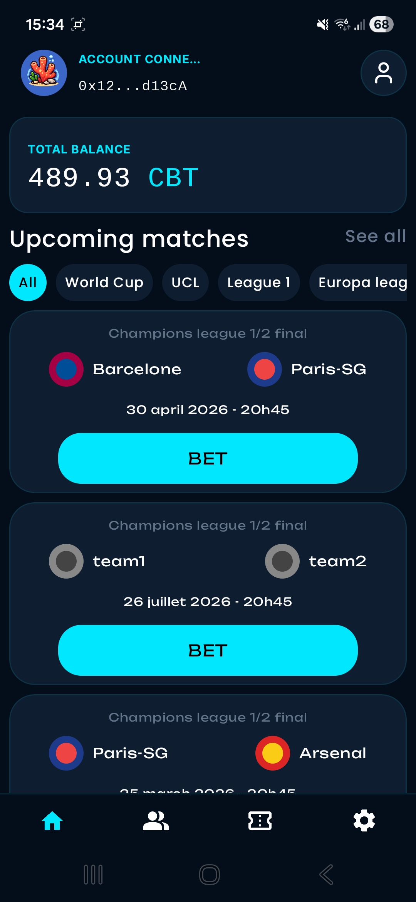
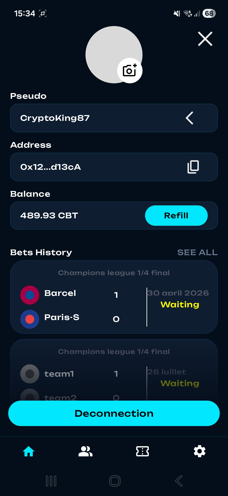
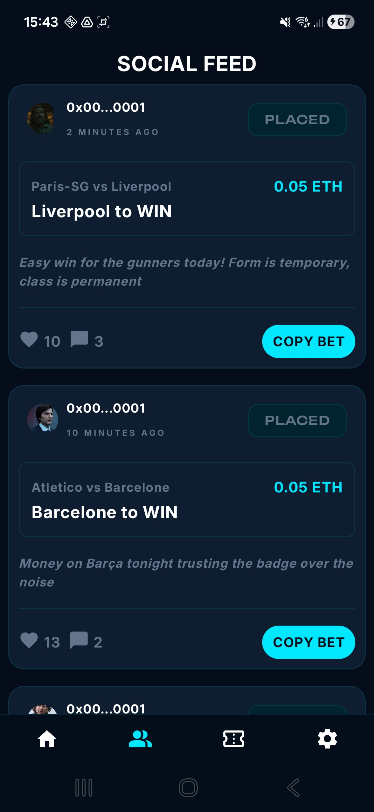
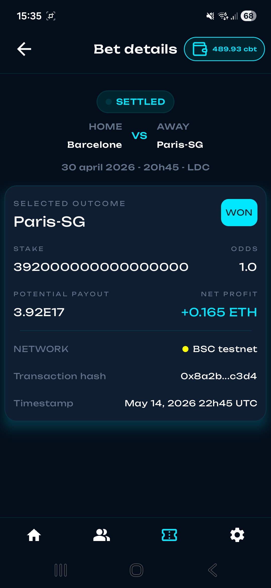

# ⚽ CoralBet – Sports Prediction dApp

A decentralized application allowing users to bet on sports events through smart contracts.

## 🚀 Overview

CoralBet is a full-stack application featuring:
- Smart Contracts: For token creation and betting logic.
- Backend: For event listening, API integration, and authentication.
- Mobile Client: For a seamless user experience.

The goal is to provide a transparent and secure betting platform powered by blockchain technology for 2026 FIFA World Cup.

---

## 🧠 Features

- 📊 Sports Betting: Create and manage bets on various events.
- 🔗 Blockchain Interaction: Direct integration with smart contracts.
- 📱 Mobile App: Intuitive UI for easy navigation.
- ⚙️ Backend API: Robust server-side data management.
- ☁️ Deployment: Hosted on Railway.

---

## 🛠️ Tech Stack

- Smart Contract : Solidity
- Backend : Ktor (Kotlin)
- ORM : Exposed
- IdEs :  Android Studio & inteliij Idea
- Déploiement : Railway
- Base de données : Neon (postegresql)
- SDK & API : Reown, Alchemy

---

## 📸 Screenshots

  
  
  
  
  

---

## 🔒 Code source

The full source code (client + server) is currently private but can be presented upon request.

---

## 📬 Contact

Feel free to reach out for more information or a live demonstration.
