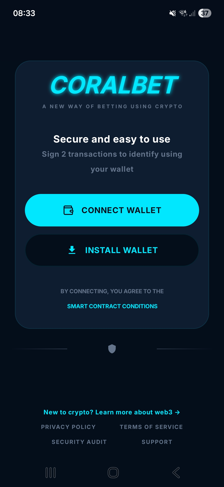

# ⚽ CoralBet – dApp de Prédiction Sportive

Application décentralisée permettant aux utilisateurs de parier sur des événements sportifs via un smart contract.

## 🚀 Aperçu

CoralBet est une application full-stack combinant :
- un smart contract pour la création du token
- un smart contract pour la gestion des paris
- un backend pour l'écoute des events, appels API et login
- un client mobile

L’objectif est de proposer une plateforme transparente et sécurisée basée sur la blockchain.

---

## 🧠 Fonctionnalités

- 📊 Création et gestion de paris sportifs
- 🔗 Interaction avec un smart contract
- 📱 Application mobile intuitive
- ⚙️ Backend API pour la gestion des données
- ☁️ Déploiement (Railway)

---

## 🏗️ Architecture

Le projet est structuré en plusieurs parties :

- **Smart Contract** : gestion des paris et des transactions
- **Backend** : API + logique serveur
- **Client mobile** : interface utilisateur

---

## 🛠️ Stack technique

- Smart Contract : Solidity
- Backend : Ktor
- ORM : Exposed
- Ide :  Android Studio + inteliijIdea
- Déploiement : Railway
- Base de données : Neon (postegresql)
- SDK & API : Reown, Alchemy

---

## 📸 Screenshots

  
  
  
  
  

---

## 🎯 Objectif du projet

Ce projet m’a permis de :
- concevoir une application complète de A à Z
- travailler sur une architecture full-stack
- intégrer des interactions avec la blockchain
- gérer le déploiement d’une application réelle

---

## 🔒 Code source

Le code complet (client + serveur) est actuellement privé, mais peut être présenté sur demande.

---

## 📬 Contact

N’hésite pas à me contacter pour en savoir plus ou pour une démonstration.
